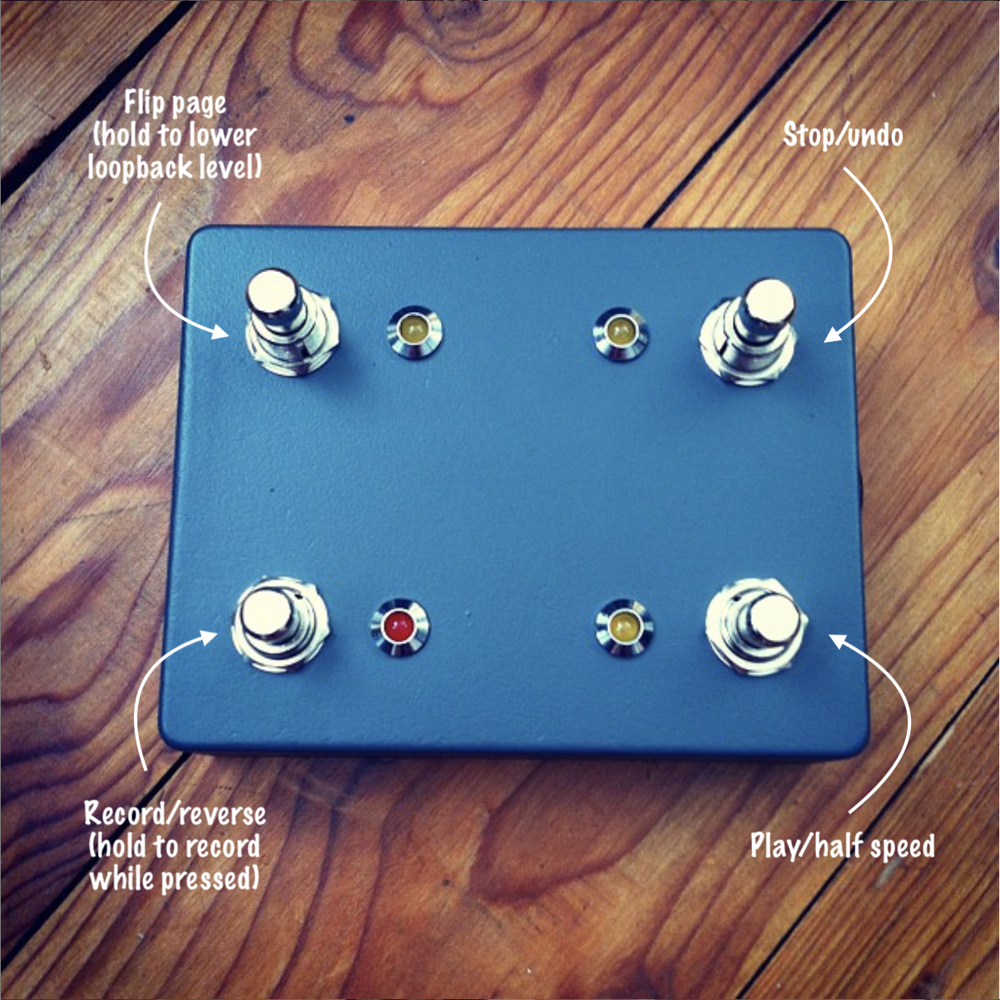

# timeline-looper-remote

## Introduction

The [Strymon Timeline](https://www.strymon.net/product/timeline/) delay effect pedal features a 30-second looper.
To control the delay effect and the looper simultaneously I built a pedal equipped with an [Arduino nano](https://store.arduino.cc/usa/arduino-nano) that remote controls the looper via MIDI.

My pedal has four stomp switches to control these functions of the looper:
* Record
* Play
* Stop
* Reverse (second page)
* Half speed (second page)
* Undo (second page)
* Decrease looper level

## Assembly

### Bill of materials

- Arduino nano
- Housing type BB
- 4x 1PST momentary footswitch
- LED red
- 2x LED yellow
- 3x LED bezel
- 5x resistor 220 R 0.25 W
- DIN jack 5 poles
- DC power jack

### Wiring diagram

## Installation

1. Download and install [PlatformIO IDE](https://platformio.org/platformio-ide).
1. Clone this repository.
1. Open the cloned repository in PlatformIO IDE.
1. Connect Arduino nano to computer.
1. Click 'Upload' in PlatformIO IDE.
